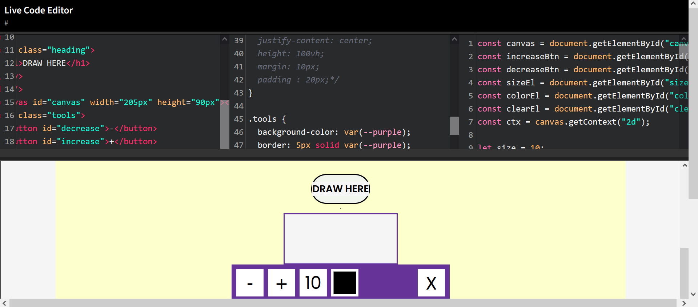

# Live Code Editor
 I am gonna create a code editor using JavaScript with CodeMirror library. in this project i'm using Code Mirror library with it's settings to create a code editor with live code preview. Also this code is fully responsive and we can change it's theme, this code is codepen site clone.

# Screenshot
Here i have project screenshot :

